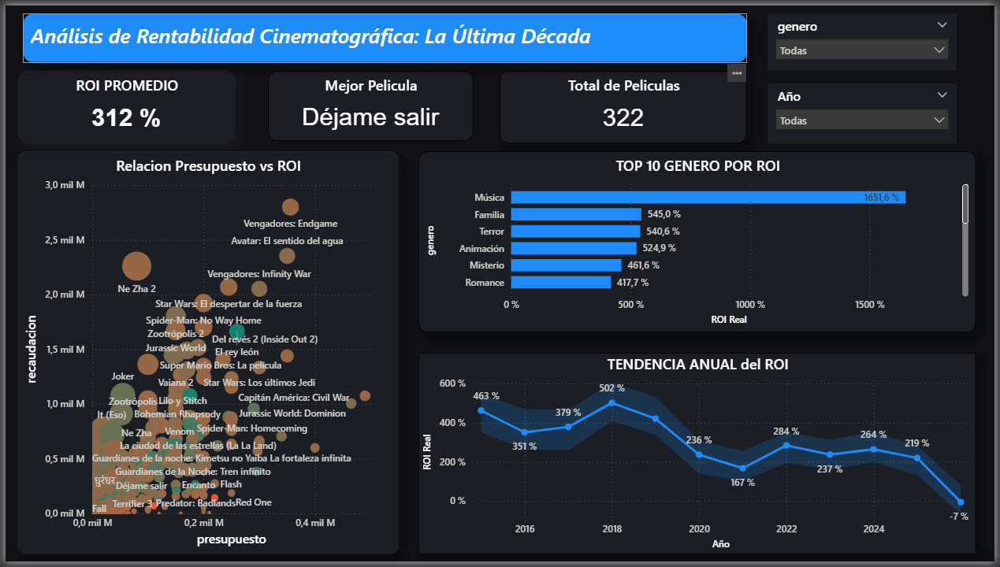

# 🎬 Análisis de Rentabilidad Cinematográfica (2015-2025)

Este proyecto analiza el Retorno de Inversión (ROI) de la industria del cine utilizando datos de la API de TMDB.  
Es mi primer proyecto de este tipo. Como parte de mi formación en la **Academy de Dicsys**, estoy poniendo a prueba todo lo aprendido en extracción y visualización de datos.

## 📊 Dashboard Final


## 🛠️ Tecnologías utilizadas
* **Python:** Extracción y limpieza de datos (Requests, Pandas).
* **Power BI:** Visualización y cálculos DAX.
* **API de TMDB:** Fuente de datos original.

## 💡 Principales Hallazgos (Insights)
* **Género más rentable:** El género de **Música** presenta el ROI más alto por película (1.651%).
* **Eficiencia en Terror:** Películas como *Déjame salir* demuestran que presupuestos bajos pueden generar retornos masivos (55x).
* **Filtros aplicados:** Se limitó el análisis a la década 2015-2025 para mayor consistencia.

## 🧠 Mi análisis
Después de limpiar toda la base y armar los gráficos, estas son las conclusiones más importantes:

### 1. El engaño de las pelis de Música 🎸
Si mirás el gráfico, el género Música tiene un ROI altísimo (1.651%), pero no es tan así como parece. En el archivo hay solo 3 películas de este tipo.
**La realidad:** Es un número muy inflado por tener pocos datos. Si querés ir a lo seguro, el género de **Terror** es mucho más estable porque tiene muchas más películas y todas rinden bien (como un 500% de promedio).

### 2. ¿Se está muriendo el cine? 📉
Si mirás la línea de tendencia, se ve claro que **2017 y 2018 fueron los mejores años**. A partir de ahí, la cosa empezó a caer.
**El dato:** Después de 2019, entre la pandemia y que ahora se gasta más plata en producir pero la gente va menos al cine, la rentabilidad no volvió a ser la misma. ¿Habrán pasado ya los años de "oro" de esta década?

### 3. Plata no es éxito 💸
En el gráfico de burbujas se nota mucho: las pelis que más presupuesto tienen no siempre son las que más ganan.
**Ejemplo real:** *"Déjame salir"* costó muy poco (4.5 millones) y devolvió 55 veces su valor. En cambio, los grande de acción gastan fortunas y con suerte duplican la inversión. A veces, menos es más.

## ⚙️ ¿Cómo arreglé los datos?
Para que el dashboard no tire números "random" o simplemente enormes, hice un par de ajustes técnicos:

* **Borré la basura:** Había películas con presupuestos de 1 o 10 dólares que rompían el promedio del ROI. Filtré para que solo aparezcan las que tienen un presupuesto real (más de 10.000 USD).
* **Filtro de años:** Me enfoqué del 2015 al 2025. Saqué el 2026 porque son pelis que todavía no se estrenaron y tienen recaudación en cero, lo que tiraba el promedio abajo.
* **Medida DAX:** Aunque ya tenía la fórmula en Python, Power BI no interpretaba bien el campo al promediar. Creé esta medida para asegurar la precisión:
  ```dax
  ROI Real = DIVIDE(SUM(recaudacion) - SUM(presupuesto), SUM(presupuesto), 0)
